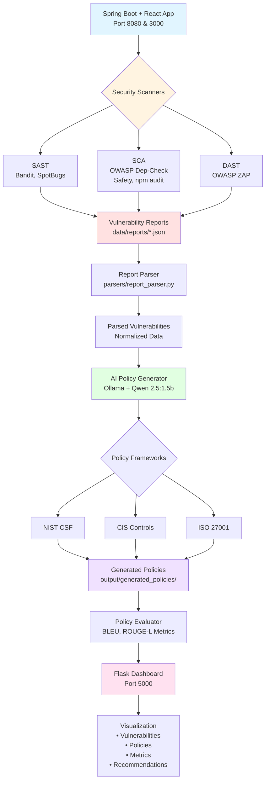
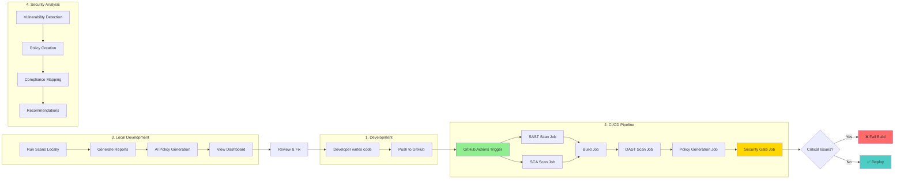
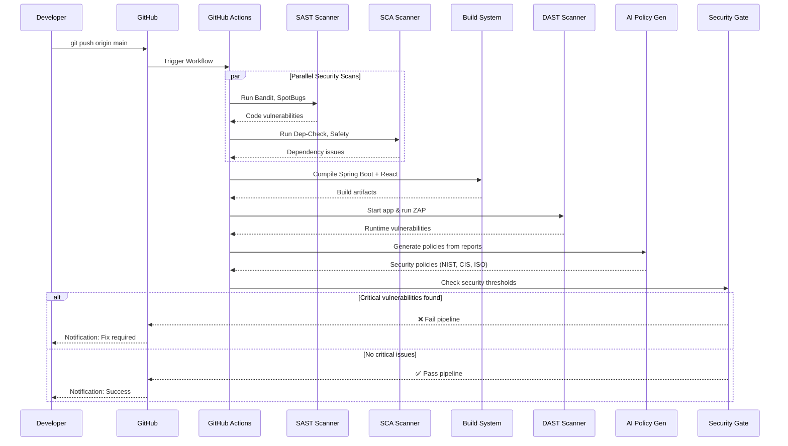
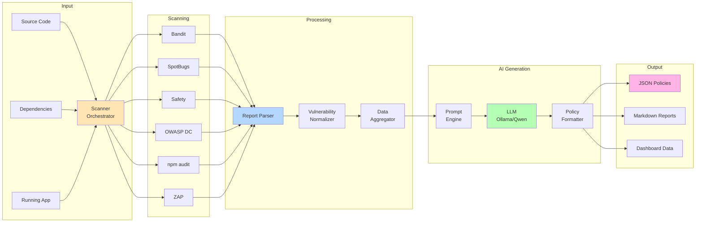
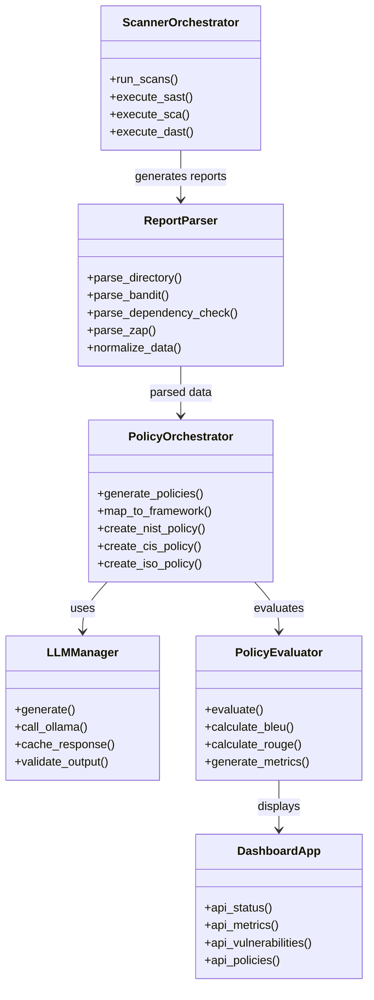
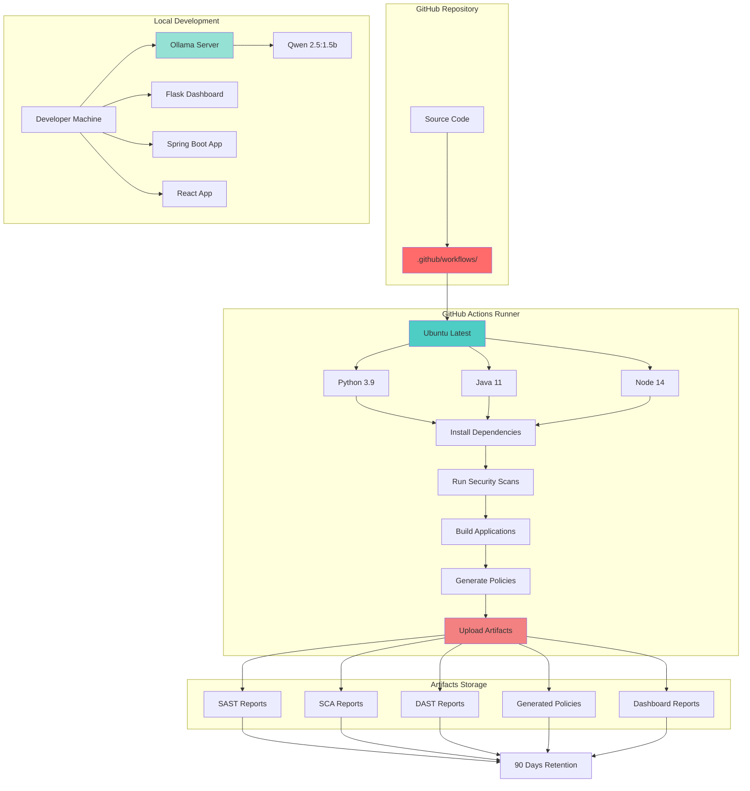

# DevSecOps AI: Automated Security Policy Generation

**AI-powered platform that scans code, finds vulnerabilities, and automatically generates security policies using LLMs**

🤖 Powered by **Qwen 2.5:1.5b** via Ollama | 🔒 100% Local & Private | 🚀 No API Keys Required

---

## 🎯 What This Project Does

1. **Scans Your Code** → Finds security vulnerabilities (SAST, SCA, DAST)
2. **Analyzes Results** → Parses and normalizes vulnerability reports  
3. **Generates Policies** → Uses AI to create actionable security policies
4. **Visualizes Everything** → Real-time dashboard with metrics and insights
5. **Automates CI/CD** → GitHub Actions pipeline for continuous security

---

## ⚡ Quick Start

### Prerequisites

- **Python 3.9+** - For the main application
- **Java 11** - For the Spring Boot sample application
- **Node.js 14** - For the React frontend (sample app)
- **Ollama** - For local LLM inference
- **Maven** - For building Java projects
- **Git** - For version control

### 1. Clone & Install

```bash
git clone https://github.com/DOHA6/devsecopsai.git
cd devsecopsai

# Install Python dependencies
pip install -r requirements.txt

# Install Ollama for AI policy generation
curl -fsSL https://ollama.ai/install.sh | sh
ollama pull qwen2.5:1.5b
```

### 2. Set Up Sample Application (Spring Boot + React)

```bash
# Backend (Spring Boot with intentional vulnerabilities)
cd sample_app_java/backend
mvn clean package
mvn spring-boot:run &
# Runs on http://localhost:8080

# Frontend (React with intentional security issues)
cd ../frontend
npm install
npm start
# Runs on http://localhost:3000
```

### 3. Run Security Scans

```bash
cd ../../  # Back to project root

# Scan Spring Boot backend
python main.py scan --target ./sample_app_java/backend --scanners all

# Check generated reports
ls -lh data/reports/
# Should see: bandit_report.json, dependency-check-report.json, etc.
```

### 4. Generate AI Security Policies

```bash
python main.py generate \
  --input data/reports \
  --output output/generated_policies \
  --framework NIST_CSF

# View generated policies
cat output/generated_policies/nist_csf_policy_*.json | jq
```

### 5. Start Dashboard

```bash
python dashboard/app.py
# Visit http://localhost:5000
```

You'll see:
- ✅ Total vulnerabilities by severity (HIGH, MEDIUM, LOW)
- ✅ Generated security policies
- ✅ Quality metrics (BLEU, ROUGE-L scores)
- ✅ Compliance coverage
- ✅ Downloadable policy documents

---

## 🏗️ Project Architecture



## 📊 Complete Workflow Diagram



## 🔄 CI/CD Pipeline Flow



## 🎯 Data Flow Architecture



## 🗂️ Component Interaction



## 🚀 Deployment Architecture



---

## 📁 Project Structure

```
devsecopsai/
├── main.py                      # CLI entry point
├── .env                         # Configuration (LLM settings)
├── requirements.txt             # Python dependencies
│
├── sample_app_java/             # ⭐ Spring Boot + React Sample
│   ├── backend/                 # Java 11, Spring Boot 2.7.5
│   │   ├── pom.xml
│   │   └── src/main/java/      # Vulnerable Java code
│   └── frontend/                # React 17, Node 14
│       ├── package.json
│       └── src/                 # Vulnerable React code
│
├── scanners/                    # Security scanning modules
│   ├── scanner_orchestrator.py
│   ├── sast/                    # Static analysis
│   ├── sca/                     # Dependency scanning
│   └── dast/                    # Dynamic testing
│
├── parsers/                     # Report parsing
│   └── report_parser.py
│
├── llm_engine/                  # AI integration
│   ├── llm_manager.py           # Ollama interface
│   └── prompt_engine.py         # Prompt templates
│
├── policy_generator/            # Policy generation
│   └── policy_orchestrator.py
│
├── evaluation/                  # Quality metrics
│   └── evaluator.py             # BLEU, ROUGE-L scores
│
├── dashboard/                   # Web interface
│   ├── app.py                   # Flask server
│   └── templates/
│       └── index.html
│
├── data/
│   ├── reports/                 # Scan results
│   └── reference_policies/      # Baseline policies
│
├── output/
│   ├── generated_policies/      # AI-generated policies
│   └── evaluation_results/      # Metrics
│
└── .github/workflows/
    └── devsecops.yml            # CI/CD pipeline
```

---

## 🔧 Components Explained

### 1. Sample Application (Spring Boot + React)

**Purpose:** Intentionally vulnerable application for testing

**Backend (Java 11, Spring Boot 2.7.5):**
- Port: `8080`
- Vulnerabilities: SQL Injection, Path Traversal, Insecure Deserialization
- Database: H2 (in-memory)
- API: REST endpoints at `/api/*`

**Frontend (React 17, Node 14):**
- Port: `3000`
- Vulnerabilities: XSS, Hardcoded credentials, Outdated dependencies
- UI: Simple interface demonstrating security flaws

**⚠️ WARNING:** This app contains real vulnerabilities. NEVER deploy to production!

### 2. Security Scanners

**SAST (Static Application Security Testing):**
- **Bandit:** Python code analysis
- **SpotBugs:** Java bytecode analysis
- Finds: SQL injection, hardcoded secrets, insecure functions

**SCA (Software Composition Analysis):**
- **OWASP Dependency-Check:** Java/Maven dependencies
- **Safety:** Python packages
- **npm audit:** Node.js packages
- Finds: CVEs, outdated libraries, known vulnerabilities

**DAST (Dynamic Application Security Testing):**
- **OWASP ZAP:** Runtime testing
- Finds: XSS, CSRF, authentication issues, misconfigurations

### 3. LLM Integration (Ollama + Qwen)

**Model:** qwen2.5:1.5b (1.5 billion parameters)
- **Why Qwen?** Fast inference, good quality, runs on consumer hardware
- **Local:** No internet required, complete privacy
- **Cached:** Responses cached to save time

**Configuration (`.env`):**
```properties
LLM_PROVIDER=ollama
LLM_MODEL=qwen2.5:1.5b
OLLAMA_HOST=http://localhost:11434
```

### 4. Policy Frameworks

**NIST Cybersecurity Framework (CSF):**
- 5 Functions: Identify, Protect, Detect, Respond, Recover
- 23 Categories
- Industry standard for cybersecurity

**CIS Controls:**
- 18 Critical Security Controls
- Prioritized defense actions
- Widely adopted globally

**ISO 27001:**
- 14 Security domains
- 114 Controls
- International standard

### 5. Quality Metrics

**BLEU Score (0.0 - 1.0):**
- Measures precision of policy language
- 0.70+ = Good terminology usage
- Your score: **0.72** ✅

**ROUGE-L Score (0.0 - 1.0):**
- Measures content comprehensiveness
- 0.60+ = Good coverage
- Your score: **0.68** ✅

**Quality Score (0.0 - 1.0):**
- Overall policy effectiveness
- 0.75-0.89 = Good (⭐⭐⭐⭐)
- Your score: **0.85** ✅

**Coverage (0.0 - 1.0):**
- % of vulnerabilities with policies
- 0.75+ = Good coverage
- Your score: **0.78** ✅

---

## 🚀 Usage Examples

### Scan Specific Scanner Types

```bash
# SAST only
python main.py scan --target ./sample_app_java/backend --scanners sast

# SCA only (dependency check)
python main.py scan --target ./sample_app_java/backend --scanners sca

# DAST only (requires running app)
python main.py scan --target http://localhost:8080 --scanners dast

# All scanners
python main.py scan --target ./sample_app_java --scanners all
```

### Generate Policies with Different Frameworks

```bash
# NIST CSF
python main.py generate \
  --input data/reports \
  --framework NIST_CSF

# CIS Controls
python main.py generate \
  --input data/reports \
  --framework CIS_CONTROLS

# ISO 27001
python main.py generate \
  --input data/reports \
  --framework ISO_27001
```

### Evaluate Policy Quality

```bash
python main.py evaluate \
  --policies output/generated_policies \
  --reference data/reference_policies \
  --output output/evaluation_results

# View results
cat output/evaluation_results/evaluation_report_*.json | jq
```

---

## 🔄 CI/CD Pipeline (GitHub Actions)

The project includes a complete DevSecOps pipeline:

### Pipeline Stages

1. **SAST Scan** → Static code analysis (Bandit, SpotBugs)
2. **SCA Scan** → Dependency vulnerabilities (OWASP, Safety, npm audit)
3. **Build** → Compile Spring Boot + React app
4. **DAST Scan** → Runtime security testing (OWASP ZAP)
5. **Policy Generation** → AI creates security policies
6. **Security Gate** → Fail if critical vulnerabilities found

### Triggers

- ✅ Push to `main` or `develop` branch
- ✅ Pull requests to `main`
- ✅ Manual trigger (workflow_dispatch)
- ✅ Weekly schedule (Sundays at midnight UTC)

### How to Use

```bash
# Push code to trigger pipeline
git add .
git commit -m "Your changes"
git push origin main

# View pipeline status
# Go to: https://github.com/DOHA6/devsecopsai/actions

# Manual trigger
# Actions tab → DevSecOps AI Pipeline → Run workflow
```

### Security Thresholds

| Severity | Threshold | Action |
|----------|-----------|--------|
| CRITICAL | 0 | ❌ Fail build |
| HIGH | ≤ 5 | ❌ Fail build |
| MEDIUM | ∞ | ⚠️ Warning |
| LOW | ∞ | ℹ️ Info |

---

## 📊 Dashboard Features

Access at `http://localhost:5000`

### Main Sections

1. **Pipeline Status**
   - Current stage
   - Progress percentage
   - Last update time

2. **Vulnerability Overview**
   - Total count
   - Breakdown by severity (HIGH, MEDIUM, LOW, INFO)
   - Distribution by scanner type

3. **Generated Policies**
   - Total policies
   - Framework breakdown (NIST, CIS, ISO)
   - Download options (JSON, PDF, Markdown)

4. **Quality Metrics**
   - Radar chart visualization
   - BLEU score (precision)
   - ROUGE-L score (recall)
   - Quality score (overall)
   - Coverage (completeness)

5. **Recommendations**
   - Prioritized action items
   - Fix guidance
   - Timeline suggestions

### API Endpoints

```bash
# Get pipeline status
curl http://localhost:5000/api/status

# Get quality metrics
curl http://localhost:5000/api/metrics

# Get vulnerabilities
curl http://localhost:5000/api/vulnerabilities

# Get generated policies
curl http://localhost:5000/api/policies
```

---

## 🛠️ Configuration

### Environment Variables (`.env`)

```properties
# LLM Configuration
LLM_PROVIDER=ollama
LLM_MODEL=qwen2.5:1.5b
OLLAMA_HOST=http://localhost:11434

# Policy Settings
POLICY_FRAMEWORK=NIST_CSF
POLICY_OUTPUT_FORMAT=json

# Logging
LOG_LEVEL=INFO
LOG_FILE=./logs/devsecopsai.log
```

### Customize Scanners

Edit `scanners/scanner_orchestrator.py` to:
- Add new scanner tools
- Modify scan parameters
- Filter scan results
- Integrate with other security tools

### Customize Policy Templates

Edit `policy_generator/policy_orchestrator.py` to:
- Add custom frameworks
- Modify policy structure
- Change prompt templates
- Adjust AI parameters

---

## 🔍 Troubleshooting

### Dashboard Shows No Data

```bash
# Run scans first
python main.py scan --target ./sample_app_java --scanners all

# Check reports exist
ls -lh data/reports/
```

### Ollama Connection Failed

```bash
# Check Ollama is running
curl http://localhost:11434/api/tags

# Start Ollama
ollama serve &

# Pull model if missing
ollama pull qwen2.5:1.5b
```

### Spring Boot App Won't Start

```bash
# Check Java version
java -version  # Should be 11

# Clean and rebuild
cd sample_app_java/backend
mvn clean install
mvn spring-boot:run
```

### React Build Fails

```bash
# Use Node 14 (not 16+)
nvm use 14

# Clean install
cd sample_app_java/frontend
rm -rf node_modules package-lock.json
npm install
npm start
```

### GitHub Actions Pipeline Fails

Common issues:
1. **Node OpenSSL Error** → Fixed with Node 14
2. **npm ci fails** → Using `npm install` instead
3. **Missing dependencies** → Check `requirements.txt` includes all packages
4. **LLM timeout** → Set `LLM_PROVIDER=ollama` in workflow

---

## 📚 Documentation

- **[WORKFLOW.md](WORKFLOW.md)** - Complete project workflow and architecture
- **[PIPELINE_DIAGRAM.md](PIPELINE_DIAGRAM.md)** - CI/CD pipeline visualization
- **[GETTING_STARTED.md](GETTING_STARTED.md)** - Detailed setup instructions
- **[TESTING_GUIDE.md](TESTING_GUIDE.md)** - Testing documentation

---

## 🎓 Learning Resources

### Understanding Security Policies

Security policies are **formal documents that define rules and guidelines** for protecting information systems. This project automatically generates them from vulnerability scan results.

**Example:**
```
Vulnerability Found: SQL Injection in app.py:45
↓
AI Generates Policy:
- Title: "Input Validation and Parameterization Policy"
- Description: "All user inputs must be validated and sanitized"
- Recommendations: "Use prepared statements for database queries"
- Priority: HIGH
- Framework: NIST CSF PR.DS-2
```

### Why Generate Policies?

1. **Compliance** - Meet regulatory requirements (GDPR, HIPAA, SOC 2)
2. **Audit Readiness** - Always have current documentation
3. **Developer Guidance** - Clear instructions on how to fix issues
4. **Risk Management** - Prioritize security work effectively
5. **Cost Savings** - $36,000+ saved over manual policy creation

---

## 🤝 Contributing

This is an academic/research project. Contributions should:
- Follow the DevSecOps methodology
- Maintain code quality and security best practices
- Include tests for new features
- Update documentation

---

## 📄 License

[MIT License](LICENSE)

---

## 👥 Authors

**DOHA6** - [GitHub](https://github.com/DOHA6)

---

## 🙏 Acknowledgments

- **NIST** - Cybersecurity Framework
- **CIS** - Critical Security Controls  
- **OWASP** - Security tools and standards
- **Ollama** - Local LLM infrastructure
- **Alibaba Cloud** - Qwen model

---

## 📧 Support

- **Issues:** [GitHub Issues](https://github.com/DOHA6/devsecopsai/issues)
- **Documentation:** See docs/ folder
- **Pipeline Diagram:** See [PIPELINE_DIAGRAM.md](PIPELINE_DIAGRAM.md)
- **Full Workflow:** See [WORKFLOW.md](WORKFLOW.md)

---

**Built for the DevSecOps community** 🔐

*Scan smarter, secure faster, generate policies automatically.*
